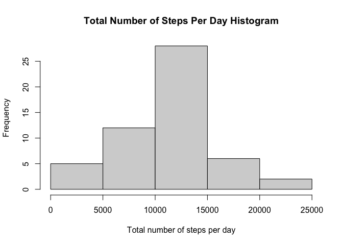
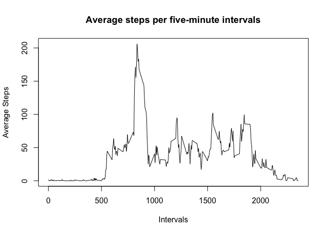
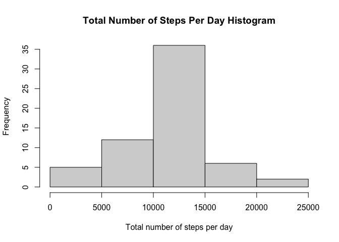
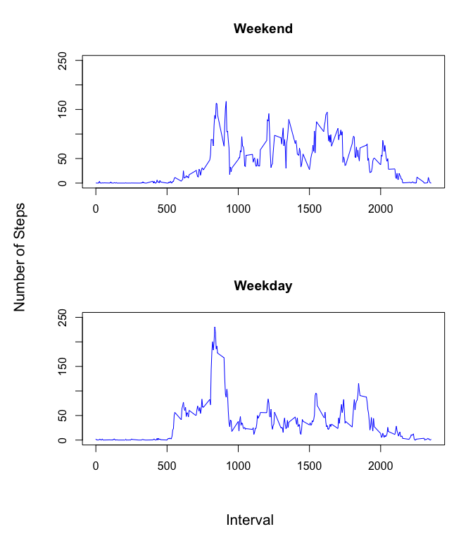

## Loading libraries

```r
install.packages("tidyverse", repos = "http://cran.us.r-project.org")
library(tidyverse)
```


## Loading and preprocessing the data

```r
rawdata <- read_csv("activity.zip")
```


## What is mean total number of steps taken per day?
The mean total number of steps taken per day is:

```r
rawdata %>% group_by(date) %>% summarise(sum=sum(steps)) %>%
  summarise(mean=mean(sum, na.rm=TRUE))
```

```
## # A tibble: 1 × 1
##     mean
##    <dbl>
## 1 10766.
```

Plotting the histogram for total number of steps per day.

```r
total_steps <- rawdata %>% group_by(date) %>% summarise(sum=sum(steps))
hist(total_steps$sum, main="Total Number of Steps Per Day Histogram",
     xlab="Total number of steps per day")
```

<!-- -->

The mean and median for total number of steps per day are:

```r
summary(total_steps$sum)[3:4]
```

```
##   Median     Mean 
## 10765.00 10766.19
```


## What is the average daily activity pattern?
Plotting the times series plot of 5-minute interval and the average number of steps taken across all days.

```r
by_interval <- rawdata %>% group_by(interval) %>%
  summarise(average=mean(steps, na.rm=TRUE)) 
plot(x=by_interval$interval, y=by_interval$average, type="l", 
     main="Average steps per five-minute intervals", xlab="Intervals",
     ylab="Average Steps")
```

<!-- -->

The interval with the maximum number of steps is:

```r
by_interval[which.max(by_interval$average),]$interval
```

```
## [1] 835
```


## Imputing missing values
The number of NAs is:

```r
newdata <- rawdata
sum(is.na(newdata$steps))
```

```
## [1] 2304
```

Using interval average values for NAs

```r
for (i in 1:nrow(newdata)) {
  if(is.na(newdata[i,]$steps)) {
    index <- by_interval %>% filter(interval==newdata[i,]$interval)
    newdata[i,]$steps <- index$average
  }
}
```
The new data set is new data.

Plotting the histogram for total number of steps per day.

```r
total_steps2 <- newdata %>% group_by(date) %>% summarise(sum=sum(steps))
hist(total_steps2$sum, main="Total Number of Steps Per Day Histogram",
     xlab="Total number of steps per day")
```

<!-- -->

The mean and median for total number of steps per day are:

```r
summary(total_steps2$sum)[3:4]
```

```
##   Median     Mean 
## 10766.19 10766.19
```

Imputing the missing data using the mean made the median become the same as the mean. Otherwise, the charts are the same.


## Are there differences in activity patterns between weekdays and weekends?
Create a new factor variable daytype with values "weekday" and "weekend".

```r
weekday <- function(date1) {
  ifelse (weekdays(date1) == "Saturday" || weekdays(date1) == "Sunday","weekend","weekday")
}
newdata2 <- newdata %>% rowwise() %>% mutate(daytype = weekday(date))
newdata2$daytype <- as.factor(newdata2$daytype)
```

Create a panel plot containing a time series and average number of steps.

```r
newdata3 <- newdata2 %>% group_by(interval, daytype) %>%
    summarise(average=mean(steps, na.rm=TRUE)) 
data_weekend <- newdata3 %>% filter(daytype=="weekend")
data_weekday <- newdata3 %>% filter(daytype=="weekday")
par(mfrow=c(2,1), oma=c(2,2,0,0))
plot(x=data_weekend$interval, y=data_weekend$average, type="l", xlab = "", ylab="", col="blue", main="Weekend", ylim=c(0, 250))
plot(x=data_weekday$interval, y=data_weekday$average, type="l", xlab = "", ylab="", col="blue", main="Weekday", ylim=c(0, 250))
mtext("Interval",side=1,line=0,outer=TRUE,cex=1.3)
mtext("Number of Steps",side=2,line=0,outer=TRUE,cex=1.3,las=0)
```

<!-- -->


